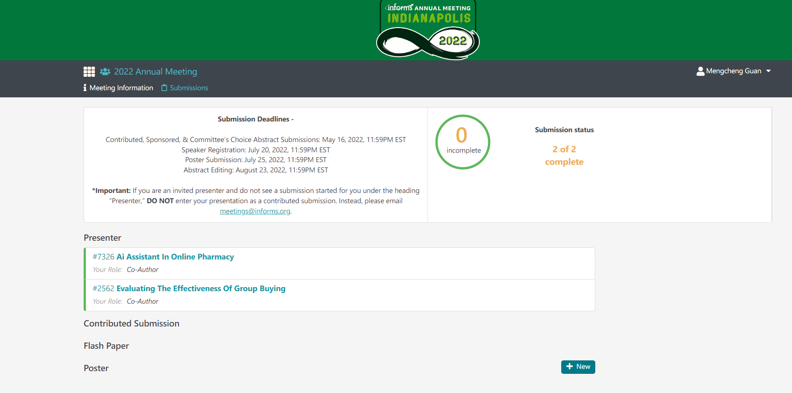

- Dates: [[2022-10-16]] - [[2022-10-19]] Sunday, October 16, 2022 - Wednesday, October 19, 2022
- Location: Indiana Convention Center, Marriott Downtown and JW Marriott Hotel
  Country: United States of America (USA)
  State: (USA) Indiana
- URL: [2022 Annual Meeting website](https://meetings.informs.org/wordpress/indianapolis2022/)
- Gmc390074336!
- [投稿系统](https://www.abstractsonline.com/dashboard/dashboard_faculty_home.html?selMod=submit&aKey=&aId=475&acctKey=7601e24f-6cb4-498b-9c20-e1a26f2cc4ab&memberId===AN0YDNzkTM&pn=&targetMKey={45E55EBD-B88E-4DFC-A316-A2AD1AD3520B}&mid=10693)
- Submission Deadlines: [[2022-5-16]]
- Abstract Guidelines (Size/Length)
  Abstract should be 750 characters maximum (approximately 60 words), title of abstract – 150 characters maximum.
- Letters, numbers, and common math symbols* accepted.
  All abstracts must be in English.
  **Do not include title or author information in the body of your abstract.**
  Abstracts will be published exactly as entered if accepted.
  Review your abstract and check for typographical and spelling errors, coherence and technical content.
  *PLEASE NOTE: Use only “text pad” when entering math symbols.
- 