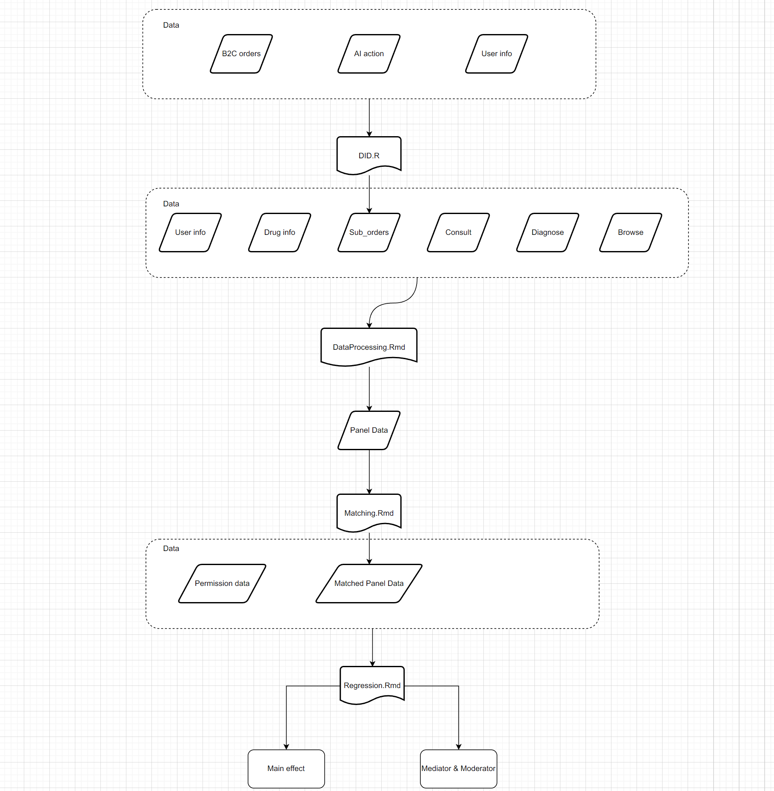

public:: true

- [[Info]]
	- 题目：AI consult
	- 作者/合作人： [[管梦城]]， [[彭景]]， [[沈通]]， [[梁辰]]
	- 启动时间： [[2021-08-01]]
	- 发表时间：
	- 目标期刊： [[Management Science]]
	- [[投稿记录]] ： [[2022 INFORMS ANNUAL MEETING]], [[CIST2022]]， [[HICSS]]， [[MIT@CODE]]
	- 审稿意见：
-
- TODO_LIST
	- DONE 隐私替代变量
	  SCHEDULED: <2022-10-10 Mon>
	  :LOGBOOK:
	  CLOCK: [2022-10-10 Mon 20:13:06]--[2022-10-10 Mon 20:13:06] =>  00:00:00
	  CLOCK: [2022-10-10 Mon 20:28:16]--[2022-10-10 Mon 20:28:17] =>  00:00:01
	  CLOCK: [2022-10-10 Mon 20:28:18]--[2022-10-10 Mon 20:28:20] =>  00:00:02
	  :END:
		- 有商品详情页隐私包装埋点，暂无表权限
		- 其他的订单表中有是否采用隐私包装字段，暂无权限
		- 有可能用户在购买隐私药品的时候才愿意选择隐私包装，购买其他药品的时候无所谓
	- DONE 确认问诊数据是否到2017年 >[2022-10-10 20:14 - 21:14](#agenda://?start=1665404075000&end=1665407675000&allDay=false) >[🍅 5min](#agenda-pomo://?t=p-1665405344370-286)
	  :LOGBOOK:
	  CLOCK: [2022-10-10 Mon 20:31:57]--[2022-10-10 Mon 20:31:57] =>  00:00:00
	  CLOCK: [2022-10-10 Mon 20:32:04]--[2022-10-10 Mon 20:32:05] =>  00:00:01
	  CLOCK: [2022-10-10 Mon 20:32:06]--[2022-10-10 Mon 20:32:06] =>  00:00:00
	  CLOCK: [2022-10-10 Mon 20:32:09]--[2022-10-10 Mon 20:32:09] =>  00:00:00
	  CLOCK: [2022-10-10 Mon 20:32:10]--[2022-10-10 Mon 20:32:10] =>  00:00:00
	  CLOCK: [2022-10-10 Mon 20:32:10]--[2022-10-10 Mon 20:32:12] =>  00:00:02
	  :END:
		- 经过查询，yw_dw.fact_yz_inquery_info的最早时间是2019-01-01
	- LATER 问诊数据分析
	  DEADLINE: <2022-10-11 Tue>
-
- ## 推进情况：
	- [[康涅狄格合作记录]]
- ## 数据及代码逻辑
  collapsed:: true
	- {:height 406, :width 989}
- ## 日志数据处理逻辑：
	- 通过命令行获取日志数据（JSON格式）
	- 通过notepad++人工修改编码为utf8
	- 将新增日志`E:\Robust Team\数据\1药网数据\GMC\MISQ\mobile-yao-app-log\raw_log\new_log 中`
	- 执行文件`E:\Guan\我的坚果云\论文\MISQ\code\log_json_to_df.ipynb` 将所有日志合并
	- 执行文件`E:/University of Connecticut/Peng, Jing - 111/Guan/JsonToDT.R` 将JSON文件转dataframe并与之前数据合并
	- 更新腾讯文档-数据情况
	-
-
- ## Framework
  collapsed:: true
	- **Main results**:Do Al doctors stimulate users'demand for drugs?  $Dep.var = \alpha + \beta*Treated_{it} + user_i + month_t + \epsilon_{it}$
		- 1a Al doctors stimulate users'overall demand for drugs.
		- **Spillover effect**
		- 1b Al doctors stimulate users'demand for other drugs.
	- **Heterogeneous effects**:How do Al effects vary across different users?
		- Low-level active users vs.High-level active users
			- 2a Low-level active users are more influenced by Al docotors
		- Early adopters vs.Late adopters
			- 2b Early adopters are more influenced by Al docotors
		- Goal-directed consumers vs.Experiential consumers
			- 2c Low incidence rate users are more influenced by Al docotors
			- 2d consideration set regarding breath:low rate users are more influenced by Al docotors
			- 2e consideration set regarding depth:low rate users are more influenced by Al docotors
		- Experience level in men-drug purchase
			- 2f less experienced users are more influenced by Al docotors
	- **Mechanisms**:Why does Al doctors stimulate users'overall demand for drugs?
		- Spillover effect
			- 3a Al doctors stimulate users'demand for drugs in other categories.
			- 3b Al doctors increase both users'high-price and low-price drug orders
			- 3c Al doctors increase users'purchase category breath
		- Al doctors increase users'activity levels on the platform
			- 3d Al doctors increase users'active days
			- 3e Al doctors increase users'browse times per active day
-
- ## Predict privacy level
	- [[Xgboost]]
- ## Comments
  collapsed:: true
	- I fixed some grammatical errors in the draft based on the version4 draft (PDF).
		- Paragraph 2, Line 9, Page 5.  "algorithm"->"algorithms"
		- Paragraph 2, Line 6, Page 7. "reached to" -> "reached"
		- Paragraph 3, Line 2, Page 8. "adoptions" -> "adoptions"
		- Paragraph 4, Line 1, Page 8. "which is equal to 1 " -> "which equals one "
		- Paragraph 1, Line 8, Page 9. "depends" -> "depending "
		- Paragraph 1, Line 1, Page 13. "where" -> "Where"
		- Paragraph 4, Line 2, Page 13. "stimulate" -> "stimulates"
		- Paragraph 1, Line 4, Page 14. " a user's" -> " users'"
		- Paragraph 1, Line 6, Page 14. "purchase" -> "purchases'"
		- Paragraph 2, Line 2, Page 16. "Due to data limit" -> "Due to the data limit'"
		- Paragraph 2, Line 6, Page 16. "use" -> "used'"
		- Paragraph 2, Line 2, Page 17. "have" -> "has'"
		- Paragraph 1, Line 2, Page 18. "shows" -> "show'"
		-
	- I updated the in-text citations according to Harvard style (Example: recent research ... to algorithms (Logg et al. 2019 , Hou and Jung 2021 , Thurman et al. 2019). Luo et al. (2021) suggested that ...).
		- Paragraph 2, Line 5, Page 1. "Miles et al. 2021" -> "Miles et al. (2021)"
		- Paragraph 1, Line 3, Page 3. "(Miles et al. 2021; Andrews et al. 2014)" -> "(Miles et al. 2021, Andrews et al. 2014)"
		- Paragraph 2, Line 6, Page 4. "Brown and Li 2014" -> "Brown and Li (2014)"
		- Paragraph 2, Line 1, Page 5. "(Logget al. 2019; Hou and Jung 2021; Thurman et al. 2019)" -> "(Logget al. 2019, Hou and Jung 2021, Thurman et al. 2019)"
		- Paragraph 2, Line 8, Page 5.  "This finding contradicts Cadario et al. 2021’s result discussed above. " -> "This finding contradicts that of Cadario et al. (2021) discussed above."
		- Paragraph 1, Line 2, Page 6.  "J. H. Kim et al. 2021 revealed ..." -> "Kim et al. (2021) revealed ..."
		- Paragraph 2, Line 5, Page 6. " (Dedehayir et al. 2020; Rogers 2010)" -> " (Dedehayir et al. 2020, Rogers 2010)"
		- Paragraph 4, Line 1, Page 6. "B. Kim et al. 2009" -> "Kim et al. (2009)"
		- Paragraph 4, Line 2, Page 6. "Wang and Hu 2009" -> "Wang and Hu (2009)"
		- Paragraph 4, Line 4, Page 6. "Logg et al. 2019" -> "Logg et al. (2019)"
		- Paragraph 3, Line 1, Page 11. "(e.g., Bapna et al. 2016; Autor 2003)" -> "(e.g., Bapna et al. 2016, Autor 2003)"
		-
		-
-