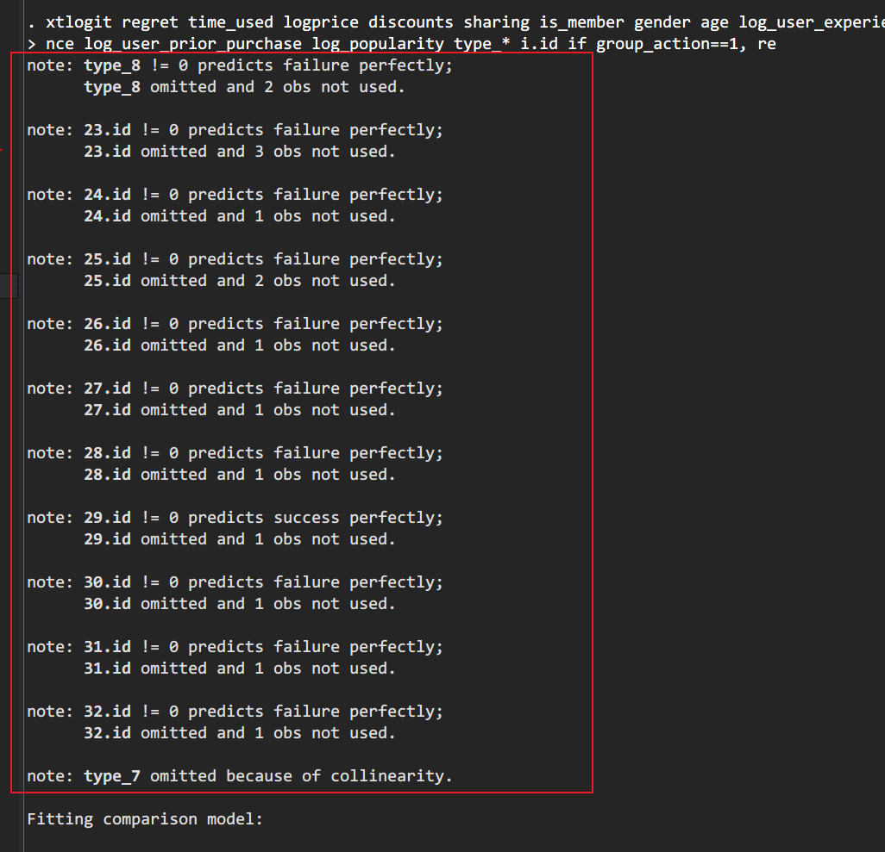
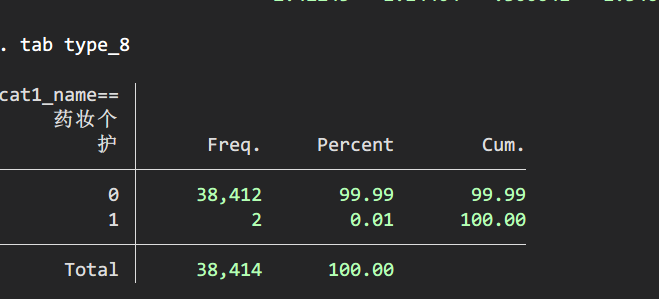
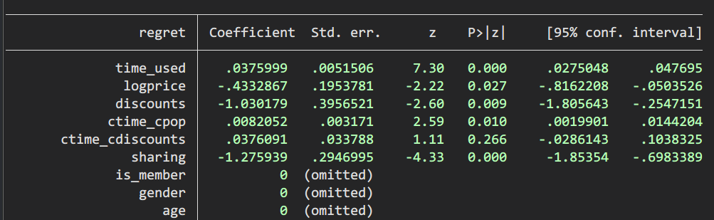
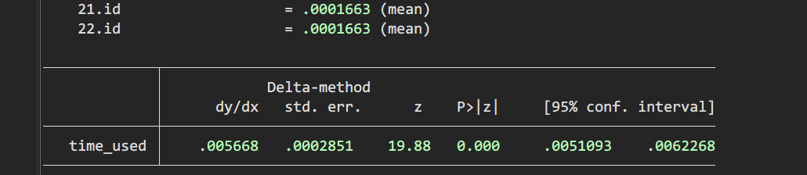

- # [[2022年03月21日]]
  collapsed:: true
	- 1. 增加Robustness checks
	- 2. 已增加poisson和xtprobit
- # [[2022年03月28日]]
  collapsed:: true
	- DONE 找到xtlogit与robustness checks样本数不一致的原因
	  collapsed:: true
	  :LOGBOOK:
	  CLOCK: [2022-05-01 Sun 17:32:02]--[2022-05-01 Sun 17:32:03] =>  00:00:01
	  CLOCK: [2022-05-01 Sun 17:32:04]--[2022-05-01 Sun 17:32:05] =>  00:00:01
	  CLOCK: [2022-05-01 Sun 17:32:06]--[2022-05-01 Sun 17:32:06] =>  00:00:00
	  :END:
	   xtlogit在回归的时候部分变量样本太少导致变量被omit，比如商品品类8（type_8），写到表格下的note中
		- {:height 529, :width 555}
		- {:height 275, :width 588}
		-
	- LATER regression results后面加上$R^2$的值
	  :LOGBOOK:
	  CLOCK: [2022-05-01 Sun 17:34:04]--[2022-05-01 Sun 17:34:05] =>  00:00:01
	  CLOCK: [2022-05-01 Sun 17:34:06]--[2022-05-01 Sun 17:34:07] =>  00:00:01
	  :END:
	- DONE 完善文献综述，增加group buying篇幅，重新写post-purchase regret
	- DONE 校对与会议论文不一样的地方
	- DONE 会议论文里的hypothesis的argue放过来
	  :LOGBOOK:
	  CLOCK: [2022-05-01 Sun 17:32:47]--[2022-05-01 Sun 17:33:08] =>  00:00:21
	  CLOCK: [2022-05-01 Sun 17:33:09]--[2022-05-01 Sun 17:33:09] =>  00:00:00
	  :END:
	- DONE 尝试xtpoisson
	  collapsed:: true
		- 不行，无法收敛，xtnbreg也无法收敛
-
- # [[2022-05-03]]
  collapsed:: true
	- 期刊/会议版本我们这边需要:
	  collapsed:: true
		- (1)更新methodology
		- (2) research context里面我们需要写清楚intiator和退款的流程问题，限定我们是非退货的退款
		- (3)introduction要按新的逻辑调整
		- (4)假设部分要增加
		- (5) [[Observational Learning]]部分（[[#red]]==仅期刊版本==）
	- 你更新完methodology的部分（因为加了新变量，robustness也要更新,会议论文和期刊论文中的表格都要更新），就更新OL的部分，然后发给我期刊版本。我改期刊版本，你写response notes，最后我过一下response notes。
	- popularity 那个 我觉得我们可以这么反驳它
	  collapsed:: true
		- 首先是在真的使用product之前quality是没办法知道的 不管是popularity还是response time都是推断quality然后调整自己的confirmation的一个方式，其次 Popularity是seller给到的信息 response time是peer customer给到的动作，一般来说 消费者更依赖peer-peer interactions rather than customer-seller interactions，因此他们调整了自己对product quality的预期
	- 论文里面那个time square记得删了
	- 我感觉我们可以说两件事
	  collapsed:: true
		- 我们研究的是 actual experience之前的退款 所以和quality的关系不大，因为没有实际的使用这个产品就退款了
		- 另外就是我们控制了brand as a proxy for quality。（历史销售数量）
- # [[2022-05-14]]
  collapsed:: true
	- model 1:
	- ```
	  xtlogit regret time_used logprice discounts ctime_cdiscounts sharing is_member gender age log_user_experience log_user_prior_purchase 
	  log_popularity sales_volume_log weekday_flag day_flag  i.id if group_action==1 & type_5==1, re
	  ```
	- model 2:
	- ```
	  xtlogit regret time_used logprice discounts c.c_time##type_5 sharing is_member gender age log_user_experience log_user_prior_purchase 
	  log_popularity sales_volume_log weekday_flag day_flag i.id if group_action==1 , re
	  ```
	-
- # [[2022-05-16]]
	- DONE time square删除 #期刊 #会议
	- 更新methodology
	  collapsed:: true
		- DONE 增加新变量(`quality, weekdays, daytime`)描述、statistics更新 #期刊 #会议
		- DONE main model 更新(增加新变量，report 之前漏掉的dealpop, discount变量) #期刊 #会议
		- DONE robustness check更新 #期刊
		- DONE correlations matrix #期刊
		- DONE 增加变量分布图 #期刊
		- DONE 更新交互效应图 #期刊 #会议
	- DONE 修改参考文献及引用格式 #期刊
	- DOING Response Letter
	  collapsed:: true
	  :LOGBOOK:
	  CLOCK: [2022-05-16 Mon 16:57:27]
	  :END:
		-
		-
		-
		-
- # [[2022-05-21]]
	- Robustness check:
	  collapsed:: true
		- DONE 所有变量放在一块跑回归
		  collapsed:: true
			- 尝试了使用re和fe，变量放在一起的时候response_time * discount 交互项不显著，其余focal effect显著 {:height 211, :width 843}
		- TODO fixed effect
	- DONE figure3去掉 #会议
	- DONE Grammarly 修改 #会议 #response_notes
	- effect size回复： 计算marginal effects
	  collapsed:: true
		- 跑了不带moderator的model后
		- 计算MEM（Marginal Effects at Means）
		  collapsed:: true
			- `margins, dydx(time_used ) atmeans`
			- 
			- response time每增加1小时，regret概率增加0.5668%
		- 计算AME（Average Marginal Effects）
		  collapsed:: true
			- `margins, dydx(time_used ) `
			- {:height 252, :width 689}
			- response time每增加1小时，regret概率增加0.5766%
			-
		-
- # [[2022-05-23]]
	- reghdfe 控制产品
	- fixed effect 作为robustness checks
	- 修改final version
- # [[2022-05-29]]
	- [[5-29]]
	-
- ## [[2022-06-16]]
	- Grammarly过一遍
	- 文献格式调整，文献校对
	- Fixed effect左右表格调整
	- 文本数据先拉一个月
	-
-
-
-
-