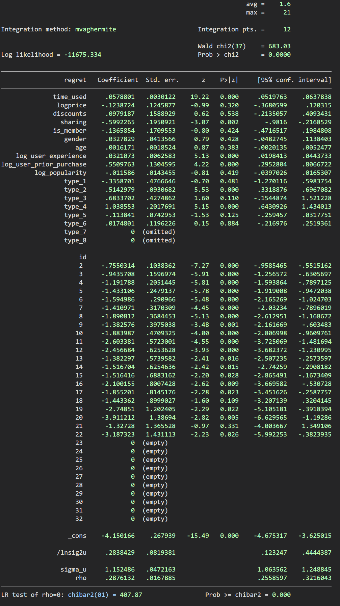

- {{renderer :tocgen}}
- 参考文献：
	- _1651409795726_0.pdf)
	-
- ##  假设检验
- ((626e83ae-1485-4e9f-860c-a0d87be94305))
- t检验的步骤：
- ((626e83fa-dcd0-43ff-85e4-29dc247414c0))
- p值：
- ((626e840f-5fae-44c3-9f29-909c0c3d13f7))
- **p值越小越倾向于拒绝原假设（零假设）**
- ## 1. 交互效应
- [【计量地图】交互效应|进来唠唠机制分析中的“交互效应” - 吴晶晶的文章 - 知乎 ](https://zhuanlan.zhihu.com/p/120310111)
- 
## 2. 知名会议
 https://www.cistconf.org/
http://www.wiseconf.org/
https://icis2021.aisconferences.org/
http://www.scecr.org/
http://2021.cswimworkshop.org/program/
https://ide.mit.edu/events/2021-conference-on-digital-experimentation-mit-codemit/#:~:text=The%20purpose%20of%20the%20Conference,computer%20science%20and%20sociology%2C%20in
- ## 3 零膨胀泊松回归（ZIP）& 零膨胀负二项回归（ZINB）
- **二者使用分布不同，ZINB多了一个离散参数**
- **ZINB比ZIP更适用于存在过离散特征的数据**
## 4 缩尾/截尾
使用命令`winsor2`
缩尾与截尾是处理离群值的方法，区别是缩尾是将离群值替换为1%和99%的值，而截尾是直接把离群值丢掉
```stata
//缩尾
winsor2 variable ,replace cut(1 99)
```
```stata
//截尾
winsor2 variable ,replace cut(1 99) trim
```
## 5 中介效应和调节效应
id:: 6270ebf9-ca34-4b0e-b0a6-0d40b9bda61b
- [[中介效应（Mediator）]]
- [[调节效应（Moderator）]]
- ## 6 面板logit模型
- {:height 564, :width 757}
- Stata的输出结果中，包含了对原假设"$H_0: \rho =0$"的LR检验结果（Stata将$\rho$记为"rho"）。如果拒绝"$H_0: \rho =0$"，则认为应采用随机效应模型;反之，则支持混合回归。上表最后一行可知，LR 检验的强烈拒绝原假设，认为应使用面板随机效应模型，不宜进行混合回归。
  选择re还是fe可以用 hausman检验
- ## 7 聚类稳健标准误
- ((626e8577-6b21-45af-a680-028a6756df8b))
-
## 8 固定效应 or 随机效应
采用hausman检验，如果prob很小，选择固定效应，否则随机效应
- LATER 理论
-
## 9 wald chi2
回归结果中wald chi2的 prob如果很小说明模型有效果
- ## ATT and ITT
- [[ATT]]
- [[ITT]]
- # 交互效应图
- [交互效应图示](https://www.lianxh.cn/news/29ab818725ff0.html)
- [interactplot：图示交乘项-交互项-调节效应](https://www.lianxh.cn/news/22d2b83df9cac.html)
- 
	- ((627b2044-1401-439a-9ffe-babbd8466fa4))
	- ((627b2077-1cab-48f1-9fc9-34e7ea185465))
	- 交叉项中心化时，主要项可以不用中心化，与主要项、交互项均中心化的差异仅在回归结果常数项估计值。
	-
- # logit model边际效应计算
	- 参考：[Stata应用：Logit模型的边际效应和交互效应分析](https://zhuanlan.zhihu.com/p/129074954)
- # Possion model depent var 不能加log
-